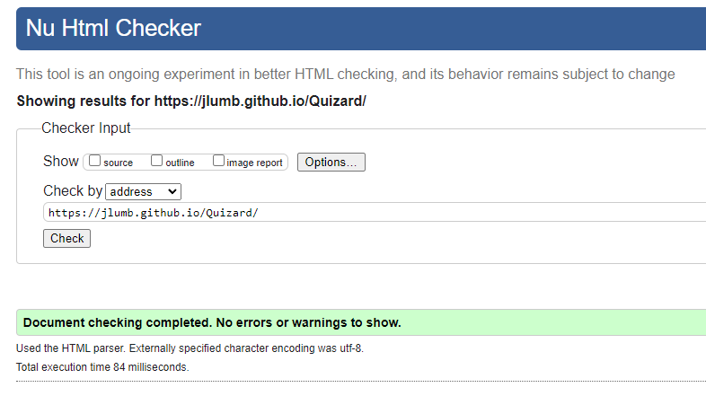
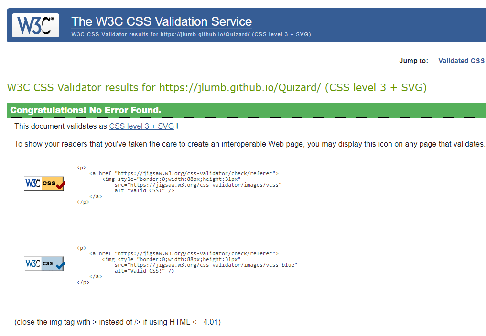
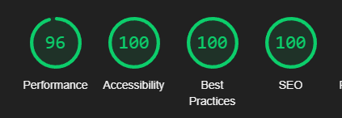
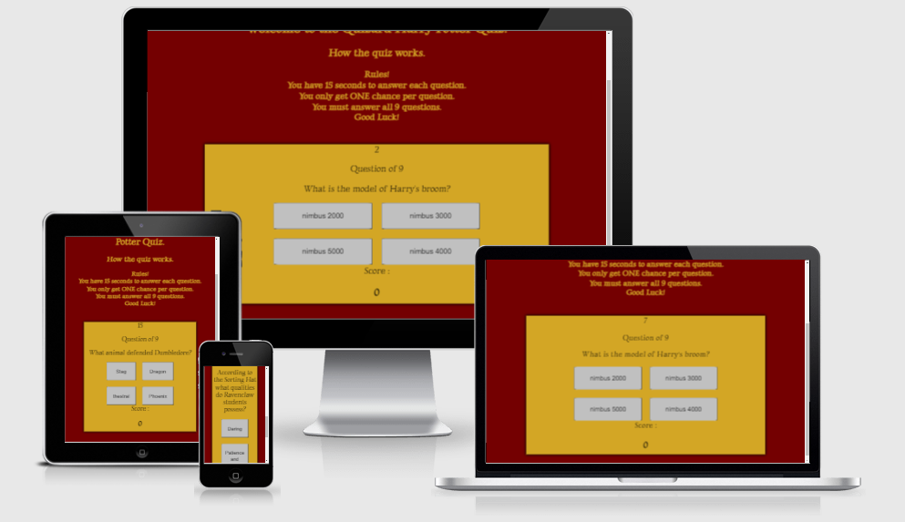

#                                                                          Quizard

##                                                                    What is Quizard?
 ### Quizard is a brand new quiz platform based around the world famous Book and Movie series Harry Potter. 
 ### The quiz will throw questions at you chosen at random at varying difficulties. Your score will be tracked so you can see your progess. 
 ### Test yourself and see if you can achieve a high score!

# Features
### Quizard has many great features, the questions will vary each time you attempt the quiz.
### Your score will be tracked too see how many questions you can get right!.
### The questions are all of varying diffuculty so there is something for the hardcore fans and the casual fans of Harry Potter!

# Testing

### I Ran my code through the HTML validator and it came back with 0 errors.
 

### I also ran my code through the CSS validator it came back 0 errors.
 

### I used the light house feature on google chrome web dev to make sure my application was running at its best.

### JShint Also returned with 0 errors for my JavaScript code.

# Further Testing and Bugs found.

#### I sent friends and family the link of the website so they could  trial and test the website for any bugs or errors, I requested feedback from them. This lead to me finding responsive design bugs where the quiz container didn't correctly display all the elements on different screen sizes, after this feedback I created two media queries to adjust the size of the container for different screen sizes.

#### After the media queries were put in place the quiz displayed nicely on all screen sizes, I made the container height larger  The button grid would now display in rows of 1 instead of 2 on smaller screens too tidy up the presentation of the quiz.

#### eventListener for checking correct answers would be inconsisten while using event.target.id. To fix this I instead used even.currentTarget.id

# User Experience

**-The experience** 
 As a First time visitor I would like to be able too understand the purpose of the website and be able to navigate easily. 

 Upon visiting the website for the first time the rules and explanation of the website are very clear and the quiz is very easy to access Via 
 the start button on the landing page.

 **-Returning experience** 

 As a returning visitor I would like to be able to have a different experience than the first visit and possibly try to beat my old scores.

 On my return visit to the website I found a new set of questions which made the experience much more enjoyable and challenging.

**-Frequent visit experience** 

 As a frequent visitor I would like to see a variety of questions each time and be able to constantly try to beat my old scores

 As i visit the website multiple times I find that the questions are constantly changing and keeping things fresh, I can beat my previous scores 
 this makes returning to this website a fun experience

 # Deployment

- I deployed my website using GitHub pages

- To do this you visit GitHub, Sign into your account.

- Navigate to the repository you are wanting to deploy

- Go to settings, Scroll down and select pages.

- This will then give you a link that is ready to be deployed

- after a few moments the link will turn green and this indicates it has been deployed and ready for use.

- https://jlumb.github.io/Quizard/

# Credits

- Huge credits and thanks to the code institute tutor team which helped me figure out the event listener for checking my answers

- The slack community helping me fix the bugs with the eventListener

- Used https://developer.mozilla.org/ to refresh my knowledge on loops and for loops.

 
